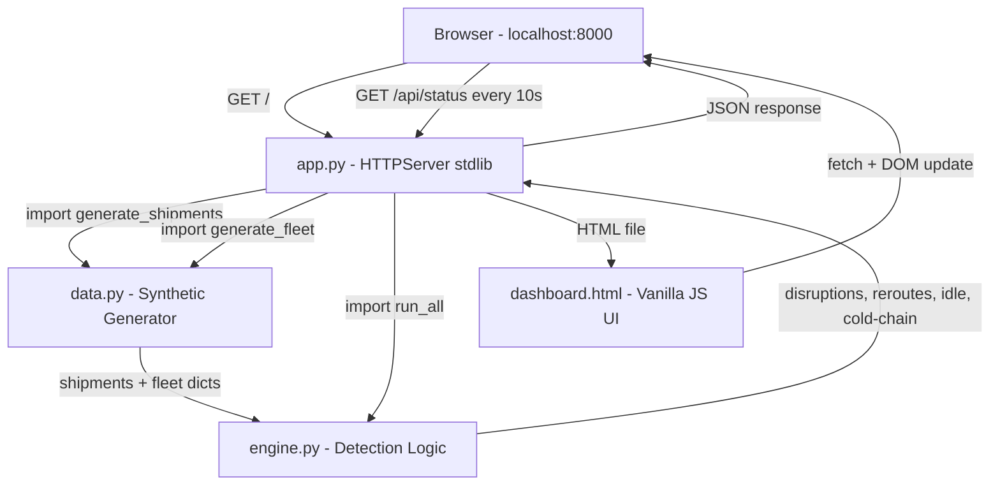

## System Architecture

## Components

| Component | File | Technology | Responsibility |
|---|---|---|---|
| HTTP Server | `src/app.py` | Python `http.server` (stdlib) | Routes requests; serves HTML and JSON |
| Data Generator | `src/data.py` | Python `random` (stdlib) | Produces deterministic synthetic shipment and fleet data |
| Detection Engine | `src/engine.py` | Pure Python | Disruption detection, reroute lookup, idle fleet filter, cold-chain alert |
| Dashboard UI | `src/dashboard.html` | HTML5 + CSS3 + Vanilla JS | Displays KPI cards and five data tables; auto-polls API |

## Data Flow

1. Browser requests `GET /api/status`
2. `app.py` calls `data.generate_shipments()` and `data.generate_fleet()` — returns plain Python dicts
3. `engine.run_all(shipments, fleet)` applies four rule-based detectors and returns a single result dict
4. `app.py` serialises the result to JSON and writes the HTTP response
5. `dashboard.html` JavaScript receives the JSON, updates KPI counters and all five table bodies, and shows a timestamp

## Security Considerations

- Binds to `localhost` only (not `0.0.0.0`) — not exposed to the network
- No user input is accepted or evaluated
- No secrets, credentials, or environment variables are required

## Scalability Notes

This is a local MVP. To scale:
- Replace `data.py` with a real TMS API client
- Replace `engine.py` rule tables with ML-based anomaly detection
- Replace `http.server` with FastAPI or Flask for async handling
- Add a real-time push layer (WebSocket or Server-Sent Events) instead of client polling
